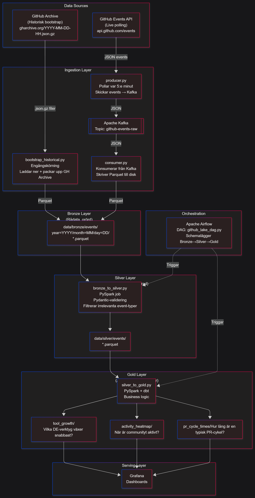

# GitHub Data Lake (Medallion Architecture)

> **Personal project - Building a scalable data lake to master the data lifecycle, data engineering, and the Medallion architecture.**



## 🧭 The Big Picture — What Is This Project?

This project is a **Data Lake** that tracks the **Data Engineering community on GitHub**.

Every time someone stars, forks, pushes code to, or opens a PR on a repository related to tools like `dbt`, `Airflow`, `Spark`, or `Kafka` — this pipeline captures that event, saves it, cleans it, and transforms it into meaningful analytics.

**The core question it answers:**  
*Which data engineering tools are growing? When is the community most active? How fast do PRs get merged?*

## 🏗️ The Architecture — Medallion Pattern

The project is built on the **Medallion Architecture**, a standard industry pattern with three data quality layers:

```
GitHub API → [Kafka] → Bronze → [PySpark] → Silver → [PySpark] → Gold → [Grafana]
               (raw)   (clean)                (aggregated)         (dashboards)
```

| Layer | Analogy | What it contains |
|-------|---------|-----------------|
| **Bronze** | Crude oil | Raw, unmodified data exactly as received |
| **Silver** | Refined oil | Validated, deduplicated, flattened data |
| **Gold** | Gasoline | Aggregated, business-ready analytics |

## 🔧 Tech Stack

* **Language:** Python 3.12 (managed via `uv`)
* **Ingestion:** Apache Kafka (KRaft mode) & GitHub REST API
* **Processing & Transformation:** PySpark, dbt
* **Storage:** Local Parquet files (Hive-styled partitioning)
* **DevOps & Quality:** Docker Compose, GitHub Actions (CI), Ruff, Pytest

## 🚀 Quickstart (Run Locally)

1. Clone the repo and copy `.env.example` to `.env`. Add your GitHub Token if you want to bypass the 60 requests/h limit (giving you 5,000 requests/h).
2. Run `uv sync` to build the environment and install dependencies.
3. Spin up the Kafka cluster:
   ```bash
   docker compose up -d
   ```
4. Run the pipeline stages using the CLI:
   ```bash
   # See available commands
   uv run python -m scripts.run_pipeline --help
   
   # Or run specific layers:
   uv run python -m scripts.run_pipeline --layer all
   ```

To bootstrap historical data to make PySpark analysis meaningful (since live polling takes time to accumulate), run:
```bash
uv run python -m scripts.bootstrap_historical --days 7
```

## 📁 Project Structure

```text
github-data-lake/
│
├── .github/workflows/          # CI/CD: lint + test on every PR
├── ingestion/                  # STEP 1: Get data in
│   ├── producer.py             # Polls GitHub API → sends to Kafka
│   └── consumer.py             # Reads Kafka → writes Parquet to Bronze
│
├── transforms/                 # STEP 2: Clean and aggregate
│   ├── bronze_to_silver.py     # PySpark: raw → validated, flat schema
│   └── silver_to_gold.py       # PySpark: validated → 3 analytics tables
│
├── scripts/                    # Utility scripts (CLI runner, historical bootstrap)
├── dbt/                        # STEP 3 (planned): SQL transformations on Gold
├── orchestration/              # STEP 4 (planned): Airflow DAG to automate it all
├── serving/                    # STEP 5 (planned): Grafana dashboards
├── data/                       # Local storage (gitignored)
│   ├── bronze/events/year=.../month=.../day=.../   # Raw Parquet
│   ├── silver/events/year=.../month=.../day=.../   # Clean Parquet
│   └── gold/                                       # Aggregated Analytics 
...
```

For more details on future plans, check the [ROADMAP](ROADMAP.md).